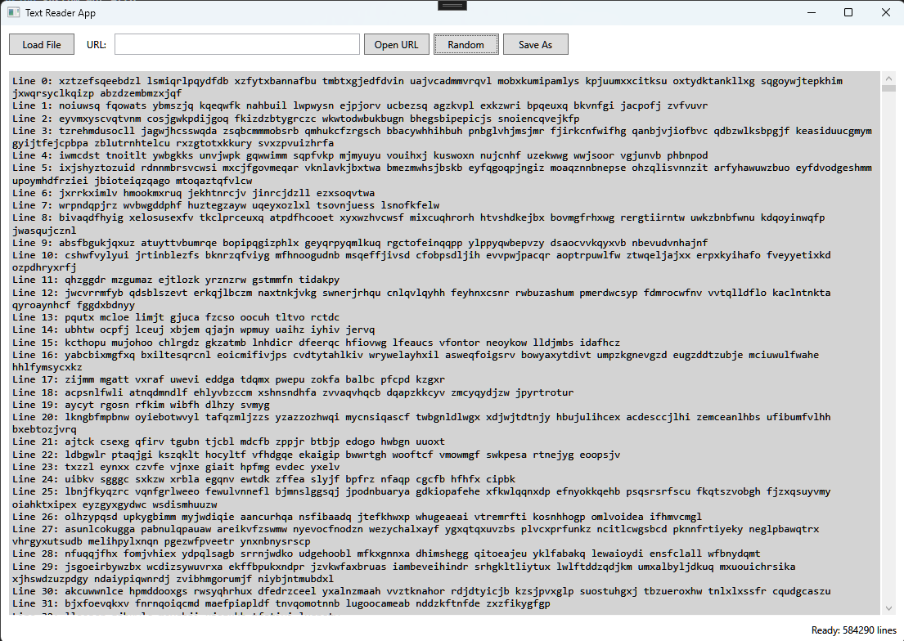

# Text Reader App

Text Reader is an application designed to read large text files. It was built using WPF and requires the .NET 8 Desktop Runtime. The application uses a single `MainWindow`. The **Load File**, **Random**, and **Load URL** buttons allow users to load data from their preferred source.

The application has been tested with text files of various sizes. Files can only be viewed, not edited. The core functionality of the application focuses on text visualization and file indexing.

When a new file is loaded from the local disk, it is initially opened in preview mode. The beginning of the file is displayed immediately, while the rest of the file is indexed in the background. Once the indexing process is complete, users can scroll through the entire file.

A `TextBlock` is used to display and scroll through the text. However, the `TextBlock` does not contain the entire loaded file. It displays only a limited number of lines, while additional content is loaded as the user scrolls.

Thanks to line virtualization and the rendering of only a limited number of lines at a time, the application remains responsive even when working with very large files. It has been successfully tested with a 10 GB text file. Instead of rendering the entire text file at once, the application gradually virtualizes and displays only the required portion of the text.

## Screenshot

  

## Supported File Types

The application supports the following local file types:

- `.txt`
- `.log`
- `.csv`
- `.json`
- `.xml`
- `.html`
- All files (`*.*`)

## Features

### Loading Content from a URL

The URL feature downloads the HTML content from the specified link and stores it in a temporary file. The temporary file is deleted when the application is closed.

### Random Text Generation

The **Generate Random** feature creates a random sequence of letters and words with a randomly selected number of lines. The generated text can contain between 500,000 and 1,000,000 lines.

### Search

Pressing `Ctrl + F` opens a search box. Search results can be navigated using the **Next** and **Previous** buttons, as well as the keyboard shortcuts described in the assignment.

## Requirements

- .NET 8 Desktop Runtime

## Project Structure

- **`MainWindow.xaml`** — Contains the graphical user interface of the main window, including its visual elements and UI events.
- **`MVVM/ViewModel/MainViewModel.cs`** — Contains the main application logic, including button commands, random text generation, URL content retrieval, and local file loading.
- **`MVVM/Utility/RelayCommand.cs`** — A utility class used to implement commands for the GUI buttons.
- **`MVVM/Services/FileIndexer.cs`** — Responsible for indexing files when they are loaded. It creates individual indexes by reading the file in 1 MB chunks.
- **`MVVM/Services/TextProvider.cs`** — Retrieves individual lines from the file using the indexes created by `FileIndexer.cs`.
- **`MVVM/Model/`** — Contains the data structures used by the application.